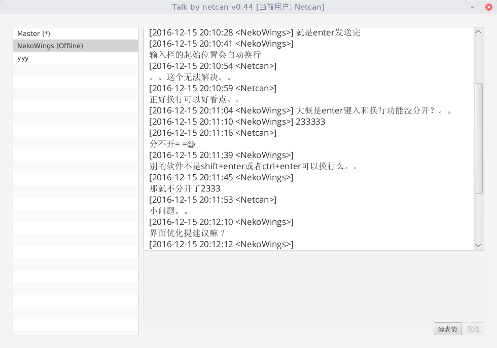
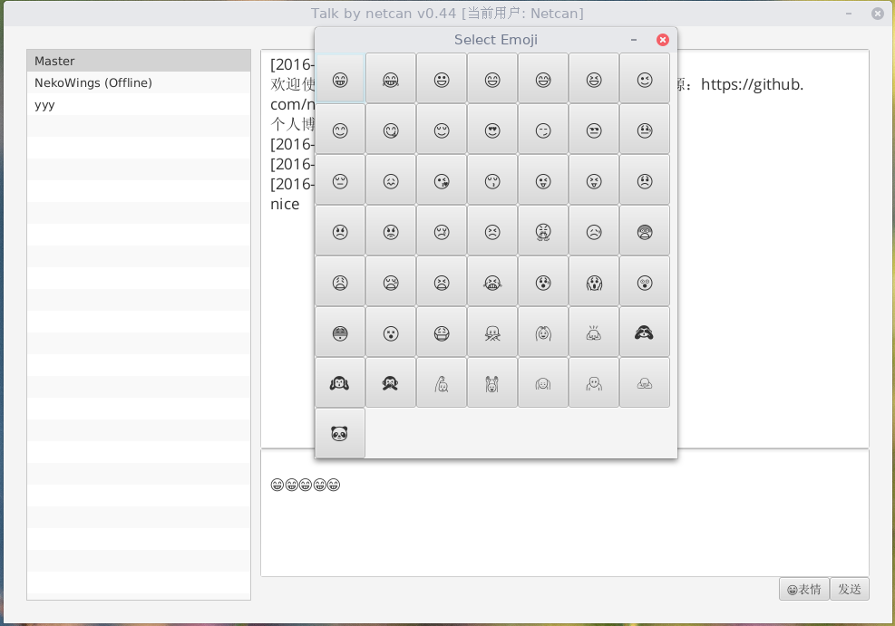
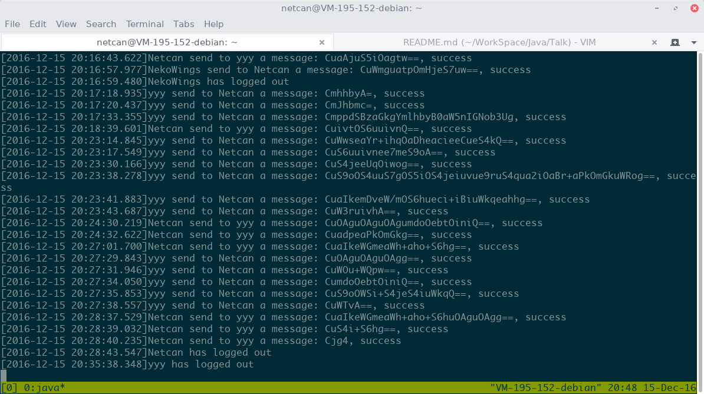
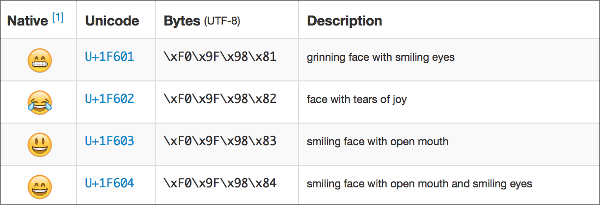

## Talk
A simple Java talk software.

这是一个Java聊天系统，作为Java实验课的内容，目前已基本完成，支持如下功能：
* 群聊
* 私聊
* 消息提醒
* 用户状态标记
* 聊天记录保存
* 表情支持

效果如下图：

这是私聊的界面，其中可以看到`Master`，表示群聊大厅，选中可以进行群聊，而选择其他用户，则表示私聊。

名字后面的`(*)`表示消息提醒，切换标签即可查看，而`(Offline)`则标记用户已经离线。



同样，可以发送表情，不那么单调。



这是服务端界面，主要是记录用户的登入、注销。



下面我就来写下我的设计思路吧。

## 设计思路
首先我要吐槽的是，界面真难写，从代码统计中可以看出，我的服务端230行左右，而客户端达到700多行，同时客户端也写的一坨，纯粹是面向过程的写法了。

这里我把客户端和服务端写到一个项目里（有3个包，一个客户端，一个服务端，一个公用数据），通过命令行参数来判断是启动客户端，还是服务端`--server`，同时互不依赖。

在写客户端的过程中，发现`Swing`比较丑，查了下资料，最后选择了`JavaFX`来构建界面。

刚开始是用`openjdk`来编写，发现没有内置`JavaFX`库，最后还是老老实实用了`Oracle-JDK`。

期间也查了不少资料，全是关于客户端的细节处理。

### 公用数据包
这里主要定义了3个类，分别介绍如下。

`Talk`类就是程序的主入口了，通过判断是否带`--server`来启动服务端或者客户端。

`TalkUser`类，主要是为服务端使用的，标记了用户名`userName`，以及该用户收到的消息队列`message`（为`[*FROM <from>]`格式，后面会讲）。同时也定义了`sendMsg`（存储用户消息）和`sendAll`（存储群聊消息）方法，来存储消息。可能方法名有点误导，比如说调用`usr.sendMsg(from, msg)`，其实是`usr`存储`from`发来的消息，而不是发送消息= =。`sendAll`类似。

`TalkEmoji`类，这个类比较智障，存储了各个`Emoji`表情的`Unicode`码，这里提前说下，其实早在2010年，`Unicode`编码就已经纳入了700多个`Emoji`表情，所以是可以支持表情的，只要加载支持`Emoji`表情的字库即可。参考链接：[How to support Emojis](http://www.guigarage.com/2015/01/support-emojis/)



### 服务端`pers.netcan.talk.server`
服务端接口设计，比较烂大街（传统）的`Master-Worker`模型，设置一个`Master`主线程，专门用来监听客户端请求；当客户端请求时，则创建一系列子线程`Workers`来处理各个客户端的请求。

需要注意的是Java很容易产生`Null`指针异常操作问题，这里要仔细处理。

之后就是设计一套专用的协议，以实现服务端与客户端的交互。

我设计的协议如下：

- 客户端请求
	- `[REGISTER]<username>`： 用户注册到服务器，服务器产生一个子线程专门来处理这个用户的请求
	- `[GETUSRS]`： 服务端返回在线用户列表`[USERS]<uesr1>, <user2>...`，用逗号隔开
	- `[SENDTO <to>]<message>`： 用户发送`message`消息给名为`to`的用户，若发送给`Master`，则`[ALLFROM]`响应。
	- `[LOGOUT]`：用户注销

- 服务端响应
	- `[USERS]<uesr1>, <user2>...`： 响应客户端的`[GETUSRS]`请求，返回各个在线用户名
	- `[OK]`： 目前仅表示用户的`[REGISTER]`请求成功，即登录成功
	- `[FAILED]`： 目前仅表示用户的`[REGISTER]`请求失败，即登录失败，可能因为重名。
	- `[FROM <from>]<message>`： 表示当前用户收到一个名为`from`用户的`message`消息。
	- `[ALLFROM <from>]<message>`： 表示当前用户收到一个名为`from`用户的群发（在`Master`标签中显示）`message`消息。

好吧，应该就那么几条指令，这样对于一个聊天系统来说足够了，需要注意的是发送的时候，用`flush`方法立即将发送缓冲区中的内容发送出去，而不是等到缓冲区满了才发送，这样就没有交互性可言了。

忘记说一点，我是这么处理用户的消息的，在`Master`中有一个`Users`全局变量（这样所有的线程都能访问了），它的类型为`<TalkUser>`，就是前面公用数据包中提到的数据结构，每当接收到用户的发送指令`[SENDTO]`时，就调用对应用户的`sendto`方法来存储消息到自己的消息队列中。而每个`Worker`线程，都会在`300ms`内检查各自处理用户的消息队列是否有消息，一有就立刻发送给对应的客户端，让客户端展示出来。

之前和一个同学讨论这个聊天软件是怎么设计比较合适，他比较纠结一个问题，就是怎么调度各个用户发送的消息，所以考虑用轮询的做法，而我一开始就没考虑过这个问题，因为很简单啊，用户A发消息给用户B，用户B直接展示出来就行了，反过来类似，如果同时发，怎么调度？当然是谁网速快就先处理谁的= =，同理，群聊也是，服务器先收到谁的，就立刻发送给各个用户，先后顺序完全由发送时间和网速来确定，所以不用考虑那么多的。（当然可能每个用户的消息记录显示顺序不一样，这也是有可能的）。

### 客户端`pers.netcan.talk.client`
客户端写的就比较凌乱了，它的职责无非就是解析服务器响应，展现给用户，同时将用户的操作（主要是发送命令）发送给服务器处理。

看起来比较容易，细节还是比较难处理的。客户端开一个线程，每`300ms`发送一个`[GETUSRS]`报文给服务器，服务器响应报文，返回用户列表，也就是说每`300ms`刷新一下用户列表，这里起到2个作用，一是相当于心跳包，维持`TCP`长连接，二是实时获取在线用户，之后就是接收消息，每`300ms`接收一条消息是可以接受的。

然而这个专门用来刷新消息的线程，若修改`UI`会出错，无奈查了大量资料，用`Task<Void>`来处理，将修改`UI`、刷新消息部分代码放到如下代码块中处理。

```java
Platform.runLater(new Runnable() {
	@Override
	public void run() {
		...
	}
});
```

用户状态标记，这里当用户离线的时候，就加个`(Offline)`标记，有新消息，就加个`(*)`标记，用正则表达式`"([\\w\\d]+)( \\((\\*|Offline)\\))?"`来匹配是哪种状态，看起来够难写的。


发送消息，响应发送按钮点击事件，和回车事件，然后将发送框中的消息`<msg>`，用户列表选中的用户`<to>`，发送`[SENDTO <to>]<msg>`指令给服务端。需要注意的是，为了减少特殊字符（例如换行）带来的麻烦，将消息字符串利用`base64`编码再发送，接收的时候再`base64`解码，就不用考虑那么多文本处理细节了。

接收消息，每`300ms`响应一下服务端，然后检查是否有`[*FROM]`响应，并将消息存储至消息记录中。客户端展现出来。

表情支持，将一些`Emoji`表情的`Unicode`码存到按钮中，然后响应按钮事件，点击按钮就把表情附加到发送框中，这里又出现一个问题，我将`emojis`定义为一个按钮数组，那么绑定事件会出现问题：
```java
for(int i=0; i<TalkEmoji.emoji.length; ++i) { // 将表情显示到按钮上
	emojis[i].setOnAction((event) -> {
			sendMsg.appendText(emojis[i].getText());
	});
}
```

将编译不过去，因为`event`的`lambda`表达式引用了`i`这个外部变量，这在`Java`中是不允许的（只能将外部变量声明为`final`），`this`我也想过了，不行，没办法，又查了大量资料，解决如下：
```java
((Button) event.getSource()).getText()
```

利用`event.getSource()`方法获取是哪个对象响应的事件。

当用户点击退出按钮的时候，就将内存中的聊天记录以用户名为文件名的方式保存到文件中，登录的时候加载一下文件的内容到内存中即可。

还有一点要注意的是，保存/读取文件需要指定编码，否则在`Win`平台下运行，保存/读取的内容将乱码。
## TODO
- ~~服务器接口~~
- ~~完成客户端~~
- ~~聊天记录保存至文件~~
- ~~增加表情支持~~

